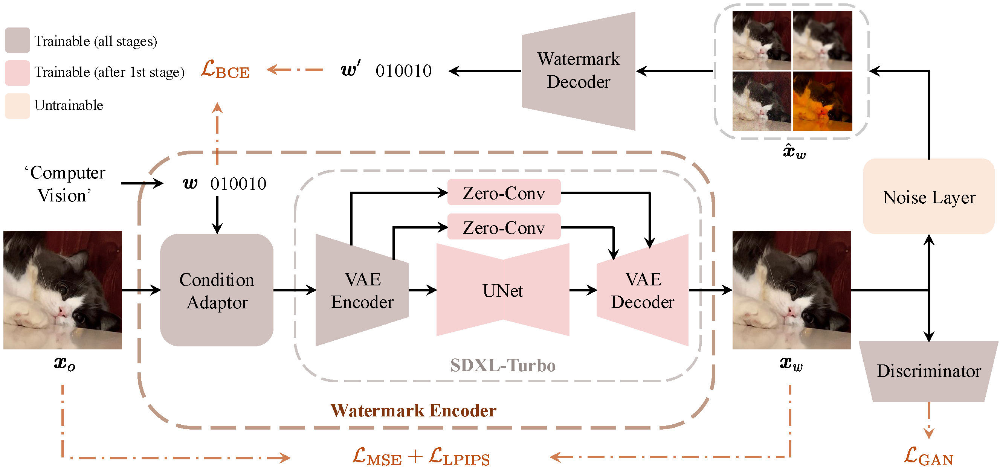

# Robust Watermarking Using Generative Priors Against Image Editing: From Benchmarking to Advances

<!-- [](https://arxiv.org/abs/2307.12493) -->

Official implementation of Robust Watermarking Using Generative Priors Against Image Editing: From Benchmarking to Advances.

> **Robust Watermarking Using Generative Priors Against Image Editing: From Benchmarking to Advances**<br>
> Shilin Lu, Zihan Zhou, Jiayou Lu, Yuanzhi Zhu, and Adams Wai-Kin Kong <br>
> 
>**Abstract**: <br>
Current image watermarking methods are vulnerable to advanced image editing techniques enabled by large-scale text-to-image models. These models can distort embedded watermarks during editing, posing significant challenges to copyright protection. In this work, we introduce W-Bench, the first comprehensive benchmark designed to evaluate the robustness of watermarking methods against a wide range of image editing techniques, including image regeneration, global editing, local editing, and image-to-video generation. Through extensive evaluations of eleven representative watermarking methods against prevalent editing techniques, we demonstrate that most methods fail to detect watermarks after such edits. To address this limitation, we propose VINE, a watermarking method that significantly enhances robustness against various image editing techniques while maintaining high image quality. Our approach involves two key innovations: (1) we analyze the frequency characteristics of image editing and identify that blurring distortions exhibit similar frequency properties, which allows us to use them as surrogate attacks during training to bolster watermark robustness; (2) we leverage a large-scale pretrained diffusion model SDXL-Turbo, adapting it for the watermarking task to achieve more imperceptible and robust watermark embedding. Experimental results show that our method achieves outstanding watermarking performance under various image editing techniques, outperforming existing methods in both image quality and robustness.


---

</div>



---

</div>

## Contents
  - [Setup](#setup)
    - [Creating a Conda Environment](#creating-a-conda-environment)
    - [Downloading VINE Checkpoints](#downloading-vine-checkpoints)
  - [Running Demo](#running-demo)


<br>

## Setup

### Creating a Conda Environment

```
git clone https://github.com/Shilin-LU/VINE.git
conda env create -f environment.yaml
conda activate vine
cd diffusers
pip install -e .
```

### Downloading VINE Checkpoints

Our models, VINE-B and VINE-R, have been released and are available for download [here](https://entuedu-my.sharepoint.com/:f:/g/personal/shilin002_e_ntu_edu_sg/Eow35WqqamtKojEB2oX1CiUBF7I-OQBioidUcj68wol-CA?e=O8MDR4).Please place them in the `./ckpt` folder.

## Running Demo
A demo showcasing the full pipeline—watermark encoding, image editing, watermark decoding, metrics calculation—is available in `./src/demo.ipynb`. Please refer to it for detailed instructions.